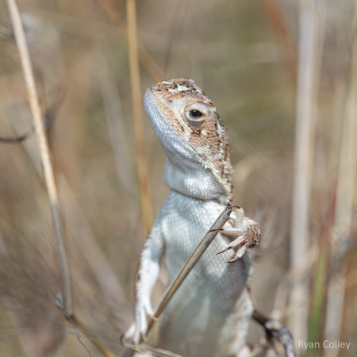

```{r setup, include=FALSE}
knitr::opts_chunk$set(
	echo = TRUE,
	message = FALSE,
	warning = FALSE
)

#necessary to render tutorial correctly
library(learnr) 
library(htmltools)
#options(repos = BiocManager::repositories())
library(dartR.data)
library(dartR.base)
gl.set.verbosity(3)

library(glDemo) # for tutorial data

```


## Introduction {data-progressive=FALSE} 

This is your hands on introduction to [dartR](https://github.com/green-striped-gecko/dartRverse?tab=readme-ov-file#dartrverse-). The worked examples and exercises in this tutorial correspond to the [[Intro to dartR ebook](http://dartr.biomatix.org/dartR)]{style="color:#ff0000;"}. There are also accompanying [AI podcast summaries](https://public.3.basecamp.com/p/Dp1F2egZGXY5siDf1MPFqyyg) for all the chapters, which you should definitely check out if you are more of an auditory learner.

If you can't see the left sidebar, you just need to make the tutorial panel wider.

### 

### R code box

Throughout this tutorial there will be interactive R scripts/consoles (like the one below). This is like a mini version of R running within this tutorial. But since we are already in R, you can also follow along in your own console and start writing your own code in the source panel. You could even try testing some of what you learn on your own data.

But first, try running the code below (press the button that says *run code*)

```{r ex, exercise=TRUE}
# Press the Run Code button to run this code
1+1
```

```{r ex-solution}
# This is an example of the interactive component 
#of this tutorial. 

# Try running some code and testing out the three buttons:
#  - Run Code, 
#  - Start Over, 
#  - and Solution

```

###

Did you notice the tick that is showing before the *R cod box* heading after running the code?

### 

It is worth noting that each R code box is independent, so code you ran in one will not be recognised by another. Don't worry though, we have done some fancy coding in the background for you to continue along, keeping track of the tasks performed before hand. 

Any troubles or tribulations with coding in dartR, we have a great community that can be found on the [dartR google group](https://groups.google.com/g/dartr).

### 

Some of the exercises within this tutorial are specific to your working environment or Rstudio, these types of exercises will be surrounded by a green box, like the one below.

::: {.my-solution icon="false"}
It might be loading in data, or setting the working environment, or creating an R project.

They need to be run in your console. These are optional at the time, if you want you can continue with the worked example and come back to these when you want to start working in your own RStudio.
:::

### 

While going through the worked examples your progress will be saved, if at any point you would like to refresh the tutorial and start over, the <small>[Start Over]{style="color:#a3a3a3; font-family:'Jaldi', sans-serif;"}</small> button is located at the bottom of the left sidebar, below the tutorial content.

### 

One final note, don't forget that all aspects of the material are beneficial for learning. The ebook for being introduced to the theory and methods, the worked examples to gain experience in the application, and finally the exercises to apply everything you have learned.

Alright! Head back to the ebook and get ready to start working through the worked examples and exercises back here when prompted.

<p>Good luck on your Pop Gen journey! 😁</p>

## The data

*Tympanocryptis lineata*, the Canberra grassland earless dragon, is endemic to Australian natural temperate grasslands (Smith et al. 1999; Scott and Keogh 2000; Melville et al. 2007; Hoehn et al. 2010; Robertson et al. 2010; Stevens et al. 2010). It is fittingly named the grassland earless dragon because of its lack of external ear openings and functional tympanum (Robertson et al. 2010). Canberra grassland earless dragons, hereafter also referred to as dragons, are a foraging species consuming a diet of predominantly ants and other invertebrates. They use a sit-and-wait approach to predate on their prey (McGrath et al. 2014). Their movement is typically no greater than 100 metres every six weeks, with localised home ranges between 925m2 and 4668m2 (Stevens et al. 2010; Hoehn et al. 2013; McGrath et al. 2014). There are only a few remaining fragmented populations found in and around Canberra (Stevens et al. 2010; Nelson and Cooper 2017).  

Nationally it is classed as endangered under the Environmental Protection and Biodiversity Conservation Act 1999 (ACT Government 2017). Monitoring of this species in the ACT began in Northern Canberra in 2002 and Western Canberra in 2006. A rapid decline in capture numbers for both populations was detected somewhere between 2004 and 2006 (Dimond et al. 2012; Hoehn et al. 2013) and more generally across several sites in the Canberra region from 1995 to 2009. The dragons have continued to decline raising conservation concern.

{.class height="450"}


Genetic samples have been collected since 2006 and now is a good time to assess the status of the remaining populations. 


```{r echo=FALSE}
#devtools::install_github("r-spatial/mapview")
#gl.map.interactive(tympo.gl)

library(leaflet)

m<-leaflet() %>% addCircles(lng = tympo.gl@other$latlon$lon,
                         lat = tympo.gl@other$latlon$lat,
                         color = c('red', 'blue','green', 'white', 'yellow')[as.numeric(tympo.gl@pop)]) %>% 
  addTiles(urlTemplate = 'http://{s}.tile.openstreetmap.org/{z}/{x}/{y}.png')
 m 
```

